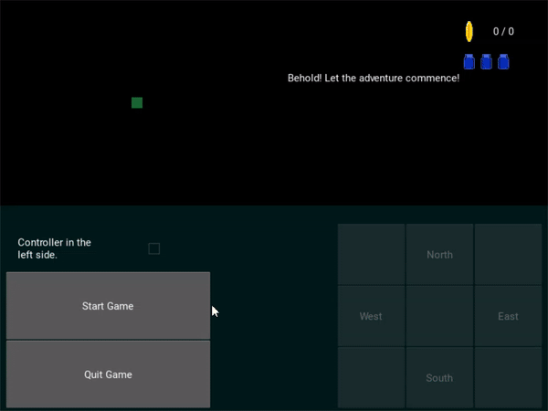
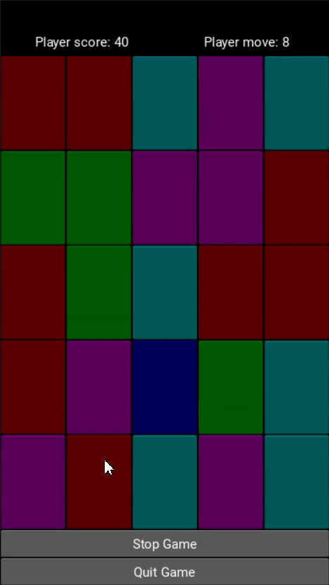

# Ramadan Code Challenge: 20 Kivy Applications in 4 Hours

Welcome to my Ramadan Code Challenge repository! 

## Overview
Throughout the holy month of Ramadan, I embarked on a daily programming challenge to develop Kivy applications with a focus on technicality. This repository showcases the results of my efforts, comprising 20 Kivy applications developed within a maximum time frame of 4 hours each.

## Goals
Each application in this collection follows the SMART (Specific, Measurable, Achievable, Relevant, and Time-bound) target, ensuring clear objectives and tangible results. The primary goal of this challenge was to hone my programming skills while adhering to strict time constraints.

## Folder Structure
- **Applications**: Contains the source code of all 20 Kivy applications.
- **Screenshots**: Provides screenshots of the applications for quick reference.

## Getting Started
To explore the applications:
1. Clone this repository to your local machine.
2. Navigate to the desired application folder.
3. Ensure that all requirements are installed.
4. Run the application using standard Python procedures.

## Contributions
Contributions to this repository are welcome! If you have suggestions for improvements or would like to contribute your own Kivy application to the collection, feel free to submit a pull request.

## Support
If you encounter any issues or have questions about any of the applications, please open an issue in the repository, and I'll do my best to assist you.

## Acknowledgments
I would like to express my gratitude to the Kivy community for their valuable resources and support throughout this challenge.

## Connect with Me
Feel free to connect with me on [LinkedIn](https://www.linkedin.com/in/ShazwanSharum) to stay updated on my latest projects and endeavors.

## Kivy Applications Preview

Here are previews of the Kivy applications developed during the Ramadan Code Challenge:

1. Fortune Cookie

2. Random Dice

3. Rock Paper Scissors - Judge Version

4. Rock Paper Scissors - Traditional

5. Who want to be a millionaire

6. Text based adventure - Into the Jungle

7. Chatbot - Jarven

8. Truth or Dare - TryDaren

9. Leap Year

10. Baby Blackjack

11. Metric Conversion Tool

12. Anas's Request

13. Area Calculator

14. Guess My Number - Dice Version

15. Word Counter

16. Santi's Request

17. Morse Code

18. Roman Numeric Converter

19. Caeser Cypher

20. Hangman

21. Tic Tac Toe

Happy coding!

